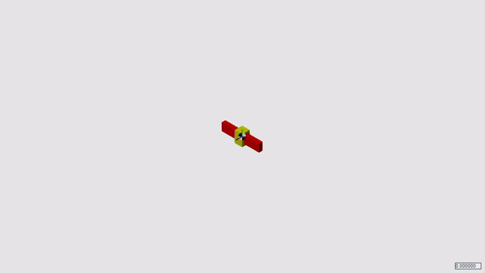

# Mass-Actuated-UAV

## Summary

A project I elected to undertake after completing the course Dynamic Systems and Control II at NIU. In this project I develop a novel UAV with a static thrust vector that maneuvers by shifting its center of mass using a servo motor. The current simulation is comprised of 7 states and 2 inputs.

## Simscape Simulation Demonstration

